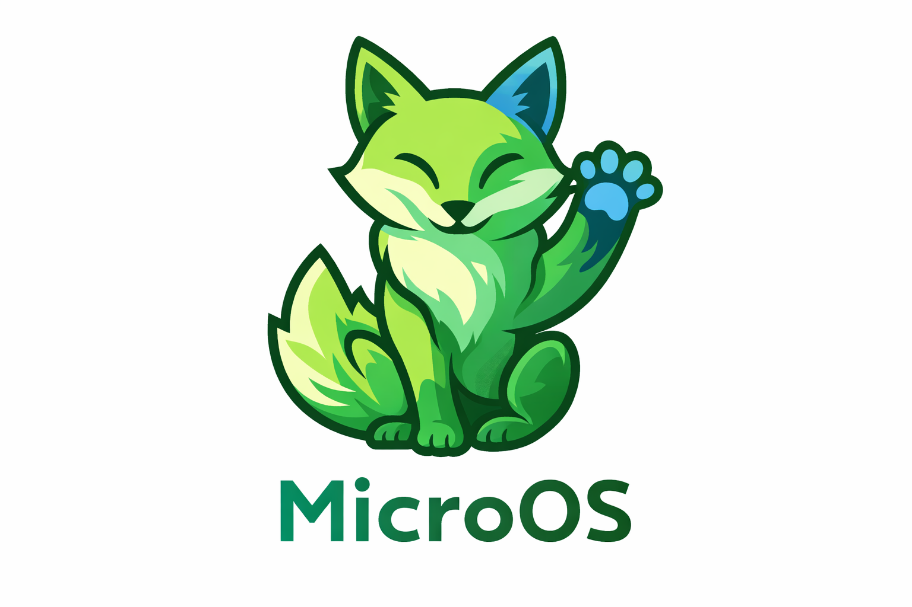

# MicroOS

MicroOS is a small operating system. It's mainly made for fun, and supports ring3 execution and memory protection.

You can test it right in your browser [here](https://glowman554.de/microos)

## Notable features

- Ring3 execution
- Memory protection
- Terminal with tab completion, pipes, redirection, and scripting
- Full vfs and a fat32 filesystem driver
- Working fasm port
- Multiple framebuffers (can be switched with the f* keys)
- C compiler (mcc) and linker for native development
- Service manager with scheduler and auto-restart
- Graphical desktop environment with mouse support (GUI mode)
- RISC-V Linux emulator (mini-rv32ima)
- Network stack with TCP/UDP sockets, DHCP, DNS, and HTTP
- Disk installer with Limine bootloader support

## Special thanks to

- [ImDaBigBoss](https://github.com/ImDaBigBoss) for making the [terminal](https://github.com/TheUltimateFoxOS/FoxOS-programs/tree/main/terminal)
- ChaN for making [fatfs](http://elm-chan.org/fsw/ff/00index_e.html)
- [Marcel](https://github.com/marceldobehere) for creating the [audio driver](https://github.com/marceldobehere/MaslOS-2/tree/main/kernel/devices/ac97)
